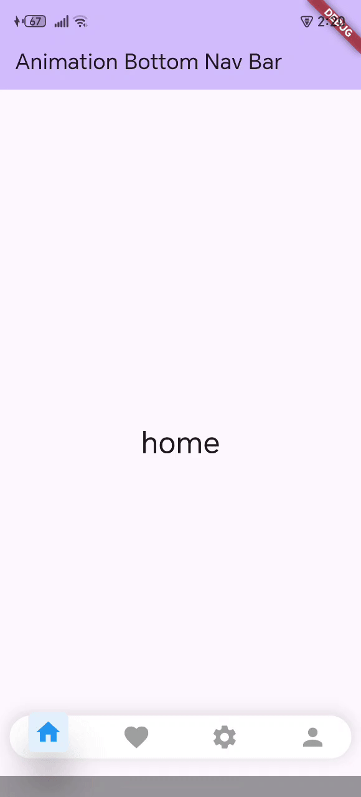

# Flutter Animated Bottom Navigation Bar 🚀

A minimal and beautiful Flutter project showcasing a custom animated bottom navigation bar — built entirely in one file (`main.dart`) for simplicity and ease of use.

---

## 📽 Preview



---

## 📌 Features

- ✅ Custom Bottom Navigation Bar
- 🎯 Smooth animation using `flutter_animate`
- ✨ Icon scale, move, and elevation effects
- 🧱 Easily customizable for any number of items
- ⚡ Lightweight — Single file (`main.dart`)
- 👨‍💻 Developer-friendly: usable by both junior and senior Flutter devs

---

## 📂 Project Structure

This project contains only one file:

```
lib/
└── main.dart
```

No unnecessary complexity — plug and play!

---

## 🚀 Getting Started

1. **Clone the Repo**  
   ```bash
   git clone https://github.com/your_username/your_repo_name.git
   cd your_repo_name
   ```

2. **Install Dependencies**  
   Make sure you have Flutter installed, then run:
   ```bash
   flutter pub get
   ```

3. **Run the App**  
   ```bash
   flutter run
   ```

---

## 🛠 How to Use the Bottom Navigation Bar

- The bar is built using a `StatefulWidget` called `BottomNavBarAnimation`.
- You can configure:
  - The number of icons.
  - The animation effects.
  - The callback function on tap.

```dart
BottomNavBarAnimation(
  pageIndex: currentIndex,
  onIndexChanged: (newIndex) => setState(() => currentIndex = newIndex),
);
```

This triggers the animation and changes the visible screen using `IndexedStack`.

---

## 🧩 Dependencies

| Package         | Purpose                            |
|-----------------|------------------------------------|
| flutter_animate | To create elegant icon animations  |

Add it to your `pubspec.yaml`:
```yaml
dependencies:
  flutter_animate: ^4.2.0
```

---

## 💡 Customization Ideas

- Replace icons with your own.
- Add labels below icons.
- Use `PageView` or full pages instead of `IndexedStack`.

---

## 🤝 Contributing

Found a bug or want to improve this nav bar? PRs are welcome!

---

## 📃 License

This project is licensed under the MIT License.

---

## 👋 Who is this for?

Whether you're a **junior** learning Flutter animations or a **senior** building production apps — this animated bottom navigation bar is for you.

Happy coding! 💙
